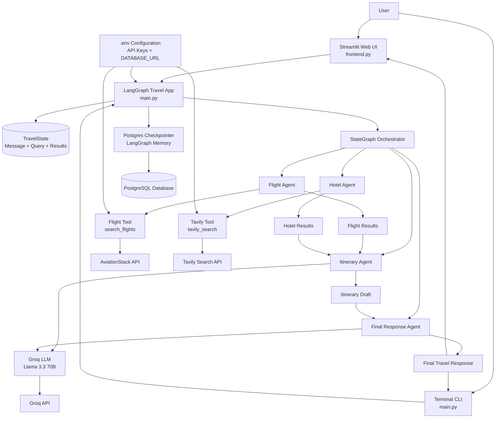
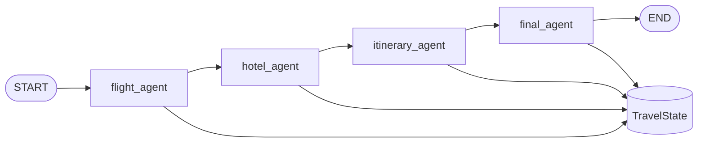

# Architecture Diagram

## System Overview

## Component Responsibilities

- User: submits a travel request through the web UI or terminal.
- Streamlit UI: provides the interactive chat/web experience.
- LangGraph App: orchestrates the multi-agent workflow.
- Agents:
  - Flight Agent: collects flight information.
  - Hotel Agent: gathers hotel recommendations.
  - Itinerary Agent: builds the travel plan.
  - Final Response Agent: composes the final answer.
- Tools:
  - Flight Tool: calls the AviationStack API.
  - Tavily Tool: performs web search for hotels and travel info.
- LLM Layer: uses Groq with Llama 3.3 to generate intelligent travel planning responses.
- Memory Layer: stores conversation/checkpoint state in PostgreSQL.

## Request Flow

1. The user enters a travel prompt.
2. The app starts the LangGraph workflow.
3. The Flight Agent and Hotel Agent gather external data.
4. The Itinerary Agent combines results and generates a trip plan.
5. The Final Agent creates the final polished response.
6. The result is shown to the user and persisted in PostgreSQL.

This workflow is implemented using LangGraph in [main.py](main.py). The graph is built as a StateGraph, where each node is a Python function and each edge describes the next execution step.

## Node Responsibilities

### 1. flight_agent
- Input: state["user_query"]
- Action: calls the flight tool through search_flights
- Output updates:
  - flight_results
  - messages.append(AIMessage(...))
  - llm_calls + 1

### 2. hotel_agent
- Input: state["user_query"]
- Action: calls tavily_search with a hotel-focused query
- Output updates:
  - hotel_results
  - messages.append(AIMessage(...))
  - llm_calls + 1

### 3. itinerary_agent
- Input: state["user_query"], state["flight_results"], state["hotel_results"]
- Action: builds a travel itinerary prompt and calls the Groq LLM
- Output updates:
  - itinerary
  - messages.append(response)
  - llm_calls + 1

### 4. final_agent
- Input: state["flight_results"], state["hotel_results"], state["itinerary"]
- Action: synthesizes the final travel response using the LLM
- Output updates:
  - messages.append(response)
  - llm_calls + 1

## Edge Connection Logic

The graph wiring in [main.py](main.py) is:

- START → flight_agent
- flight_agent → hotel_agent
- hotel_agent → itinerary_agent
- itinerary_agent → final_agent
- final_agent → END

This means the workflow runs in a strict pipeline. Each node depends on the state produced by the previous node.

## How Agents Communicate

Agents do not call each other directly. Instead, they communicate through the shared state object called TravelState.

The communication pattern is:

1. A node reads from the current state.
2. A node updates one or more state fields.
3. The graph passes the updated state to the next node.
4. The next node uses those values as input.

### Example
- flight_agent writes flight_results
- hotel_agent reads user_query and writes hotel_results
- itinerary_agent reads both results and writes itinerary
- final_agent reads all of them and produces the final answer

## Technical State Structure

The shared state contains:

- messages: list of conversation messages
- user_query: original travel request
- flight_results: flight information from the flight tool
- hotel_results: hotel information from Tavily
- itinerary: generated itinerary text
- llm_calls: count of LLM executions

## External Tool Integration

- [tools/flight_tool.py](tools/flight_tool.py): calls the AviationStack API
- [tools/tavily_tool.py](tools/tavily_tool.py): calls the Tavily API
- Groq LLM: generates the itinerary and final response
- PostgreSQL checkpointer: stores the workflow state for persistence

## End-to-End Execution Flow

1. The user submits a travel prompt.
2. The graph starts at START.
3. flight_agent gathers flight data.
4. hotel_agent gathers hotel data.
5. itinerary_agent combines both sources and generates a plan.
6. final_agent produces the final polished response.
7. The workflow ends at END.
