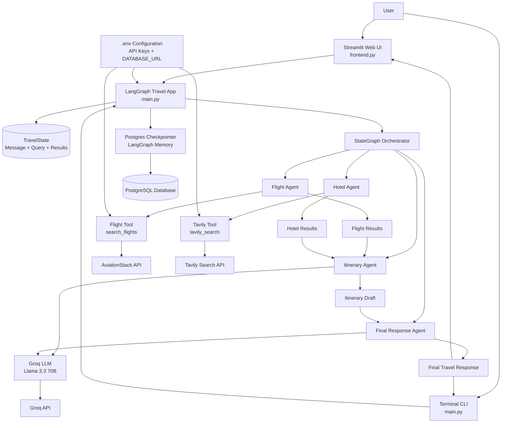

# Architecture Diagram

## System Overview

## Component Responsibilities

- User: submits a travel request through the web UI or terminal.
- Streamlit UI: provides the interactive chat/web experience.
- LangGraph App: orchestrates the multi-agent workflow.
- Agents:
  - Flight Agent: collects flight information.
  - Hotel Agent: gathers hotel recommendations.
  - Itinerary Agent: builds the travel plan.
  - Final Response Agent: composes the final answer.
- Tools:
  - Flight Tool: calls the AviationStack API.
  - Tavily Tool: performs web search for hotels and travel info.
- LLM Layer: uses Groq with Llama 3.3 to generate intelligent travel planning responses.
- Memory Layer: stores conversation/checkpoint state in PostgreSQL.

## Request Flow

1. The user enters a travel prompt.
2. The app starts the LangGraph workflow.
3. The Flight Agent and Hotel Agent gather external data.
4. The Itinerary Agent combines results and generates a trip plan.
5. The Final Agent creates the final polished response.
6. The result is shown to the user and persisted in PostgreSQL.
